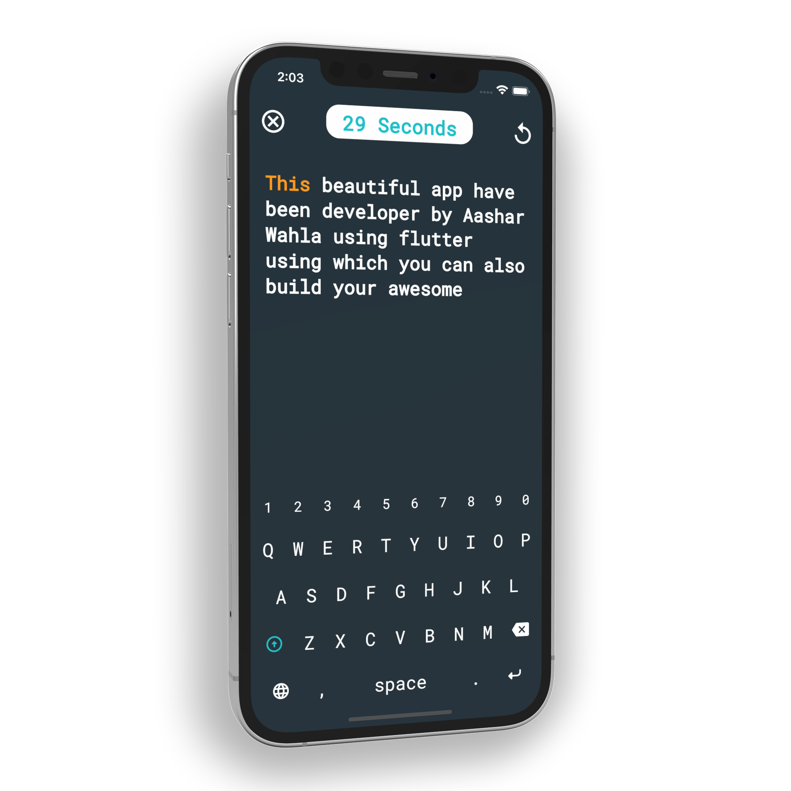

<!--
This README describes the package. If you publish this package to pub.dev,
this README's contents appear on the landing page for your package.

For information about how to write a good package README, see the guide for
[writing package pages](https://dart.dev/guides/libraries/writing-package-pages).

For general information about developing packages, see the Dart guide for
[creating packages](https://dart.dev/guides/libraries/create-library-packages)
and the Flutter guide for
[developing packages and plugins](https://flutter.dev/developing-packages).
-->

# Custom Keyboard

"Custom Keyboard" is a plugin that you can use in your project with 100% control over it.
Hi, I am Aashar Wahla (https://www.aasharwahla.com). A developer, working with Flutter since v0.8.
I was recently working on a personal project and had to make a custom keyboard. I was unable to find any custom package for that, so I decided to make my package public.

## Image

<!--  -->


## Feature

As can be seen in the image, the is nothing fixed. Everything is customizable, from keyboard height, width, and background color to on tap color.

## Getting started

TODO: List prerequisites and provide or point to information on how to
start using the package.

## Usage

Constructor looks something like this:

```dart
const CustomKeyboard({
    Key? key,
    required this.backgroundColor,
    required this.bottomPaddingColor,
    required this.bottomPaddingHeight,
    required this.keyboardHeight,
    required this.keyboardWidth,
    required this.onChange,
    required this.onTapColor,
    required this.textColor,
    required this.keybordButtonColor,
    required this.elevation,
    required this.controller,
  })
```

I didn't want to make a

```dart
    required this.backgroundColor,
```

This is backgroud color for the keyboard.

```dart
    required this.bottomPaddingColor,
```

Color for the bottom padding.

```dart
    required this.bottomPaddingHeight,
```

This parameter defines how much space you would like to be left from the bottom of the keyboard. **This is not added to the total height of the keyboard**

```dart
    required this.keyboardHeight,
```

Total height of the keyboard.

```dart
    required this.keyboardWidth,
```

Total width of the keyboard

```dart
    required this.onChange,
```

**Function** which will execute on value change in keyboard.

```dart
    required this.onTapColor,
```

Color of the button, when it get tapped.

```dart
    required this.textColor,
```

Color of the character which are displayed on the keyboard.

```dart
    required this.keybordButtonColor,
```

Color of the keyboard button.

```dart
    required this.elevation,
```

**MaterialStateProperty.all< double>** this represents elevation of individual keys in the keyboard

```dart
    required this.controller,
```

You ave to pass it, whether or not you use it.

```dart
   CKController controller = CKController();
```

## Important

Make sure to use **_CKController_**.

## Additional information

It's my first time deploying a package, so if you want to add something to it you are welcomed.<br>
<br>
<br>
<br>

### Connect with me:

[][website]
[][youtube]
[][twitter]
[][linkedin]
[][instagram]

<br />
<br>

<br />
<br>

<br>
<br>

## Visitors Count


<br>
<br>

## Thanks

[website]: https://aasharwahla.com
[twitter]: https://twitter.com/AasharWahla
[youtube]: https://youtube.com/AasharWahla
[instagram]: https://instagram.com/aashar.wahla
[linkedin]: https://linkedin.com/in/AasharWahla
